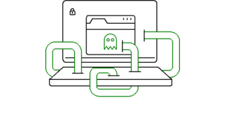
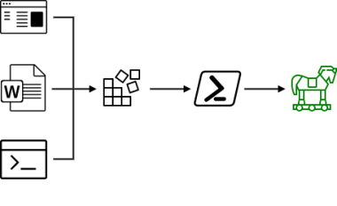

## r77 Rootkit

### Fileless ring 3 rootkit

 - Hides processes, files, network connections, etc.
 - Out of the box, single file installer
 - Fileless persistence, in-memory injection

 

## PEunion

### Crypter, binder & downloader

 - In-memory decryption & execution
 - Two-layer execution architecture

 

## Living Off The Land

### State of the art fileless attacks

 - Execution without any files
 - Process injection
 - Persistence

... It's technically not even there

